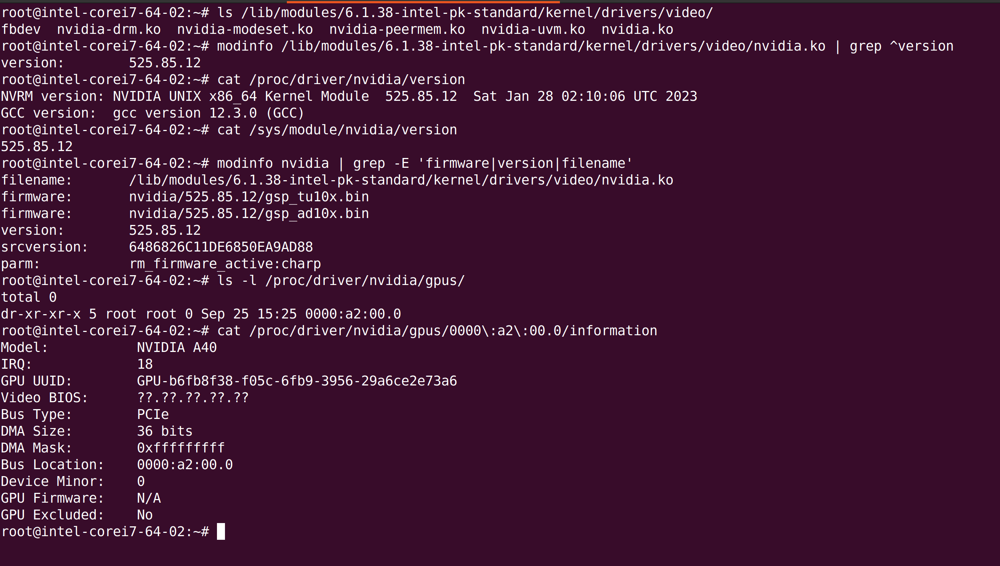

# Overview

The meta-nvidia layer provides support for NVIDIA graphics drivers and related components for Yocto Project-based distributions. This layer includes recipes for building the NVIDIA binary graphics driver, the GL Vendor-Neutral Dispatch library (libglvnd), and modifications to the mesa package to ensure compatibility with NVIDIA's proprietary drivers.


# Contents

- Configuration: The layer.conf file contains the necessary configurations for the layer, including BBPATH, BBFILES, and other essential settings.
- Custom Licenses: The custom-licenses directory contains custom license files that may be required by the recipes in this layer.
- Recipes:
    - libglvnd: Provides the GL Vendor-Neutral Dispatch library.
    - mesa: Contains modifications to the mesa package to ensure compatibility with NVIDIA's proprietary drivers.
    - nvidia: Contains recipes for building NVIDIA's binary graphics driver and related components.

# Key Features

- libglvnd: The GL Vendor-Neutral Dispatch library allows multiple OpenGL implementations to coexist on the same system.
- NVIDIA Binary Graphics Driver: Provides support for NVIDIA GPUs, enabling hardware-accelerated graphics, CUDA support, and other NVIDIA-specific features.
- Mesa Modifications: Ensures that the open-source Mesa graphics library can coexist with NVIDIA's proprietary drivers.

# Usage

To use the meta-nvidia layer in your Yocto Project build:

- Clone the meta-nvidia repository to your local machine.
- Add the path to the meta-nvidia layer to your bblayers.conf file.
- Include the desired recipes in your image or build them individually using bitbake.

To use this layer, include it in your bblayers.conf and add the
following to your BSP, distro, or local config:

```bash
DISTRO_FEATURES:append = " x11 opengl"
DISTRO_FEATURES:remove = " wayland"
IMAGE_INSTALL:append = " libxshmfence cmake"
IMAGE_INSTALL:append = " packagegroup-core-buildessential"
IMAGE_INSTALL:append = " acpid"
IMAGE_INSTALL:append = " nvidia"
PREFERRED_PROVIDER_virtual/libgl = "libglvnd"
PREFERRED_PROVIDER_virtual/libgles1 = "libglvnd"
PREFERRED_PROVIDER_virtual/libgles3 = "libglvnd"
PREFERRED_PROVIDER_virtual/egl = "libglvnd"
PREFERRED_PROVIDER_virtual/libgl-native = "mesa-native"
PREFERRED_PROVIDER_virtual/nativesdk-libgl = "nativesdk-mesa-gl"
PREFERRED_PROVIDER_virtual/mesa = "libglvnd"
KERNEL_MODULE_AUTOLOAD:append = " nvidia nvidia-drm nvidia-modeset nvidia-uvm"
XSERVER = " \
    ${XSERVER_X86_BASE} \
    ${XSERVER_X86_EXT} \
    ${XSERVER_X86_MODESETTING} \
    nvidia"
```

# Testing nvidia-container-toolkit and GPU Workloads

- For testing nvidia-container-toolkit inside the container execute the following commands:

```bash
sudo ctr images pull docker.io/nvidia/cuda:12.0.0-base-ubuntu20.04

sudo ctr run --rm --gpus 0 --runtime io.containerd.runc.v1 --privileged docker.io/nvidia/cuda:12.0.0-base-ubuntu20.04 nvidia-smi nvidia-smi
```

- For testing nvidia-container-toolkit with k3s

```bash
cat <<EOF | kubectl create -f -
apiVersion: v1
kind: Pod
metadata:
  name: gpu
spec:
  restartPolicy: Never
  runtimeClassName: nvidia
  containers:
    - name: gpu
      image: "nvidia/cuda:12.0.0-base-ubuntu20.04"
      command: [ "/bin/bash", "-c", "--" ]
      args: [ "while true; do sleep 30; done;" ]
      resources:
        limits:
          nvidia.com/gpu: 0
EOF

kubectl exec -it gpu -- nvidia-smi
```

- For testing a sample GPU workload in k3s

```bash
cat << EOF | kubectl create -f -
apiVersion: v1
kind: Pod
metadata:
  name: cuda-vectoradd
spec:
  restartPolicy: OnFailure
  runtimeClassName: nvidia
  containers:
  - name: cuda-vectoradd
    image: "nvidia/samples:vectoradd-cuda11.2.1"
    resources:
      limits:
         nvidia.com/gpu: 0
EOF
```

# Dependencies

This layer depends on following layers:

    URI: git://git.yoctoproject.org/poky
    layers: meta
    branch: mickledore

    URI: git://git.yoctoproject.org/meta-openembedded
    layers: meta-oe
    branch: mickledore

    URI: git://git.yoctoproject.org/meta-virtualization
    layers: meta-virtualization
    branch: mickledore


# Compatibility

The meta-nvidia layer is ONLY compatible with the "mickledore" series of the Yocto Project.

# License

The recipes in this layer are licensed under various licenses, including MIT, BSD, and NVIDIA's proprietary license. Please refer to the individual recipe files and the custom-licenses directory for detailed licensing information.
Contributing

Contributions to the meta-nvidia layer are welcome. Please ensure that any changes are tested with the target hardware and do not introduce regressions.

# Disclaimer

This layer is not officially supported by NVIDIA Corporation. It is based on meta-nvidia from deprecated [OakLabsInc](https://github.com/OakLabsInc/meta-nvidia). Always refer to NVIDIA's official documentation and support channels for information related to NVIDIA products.