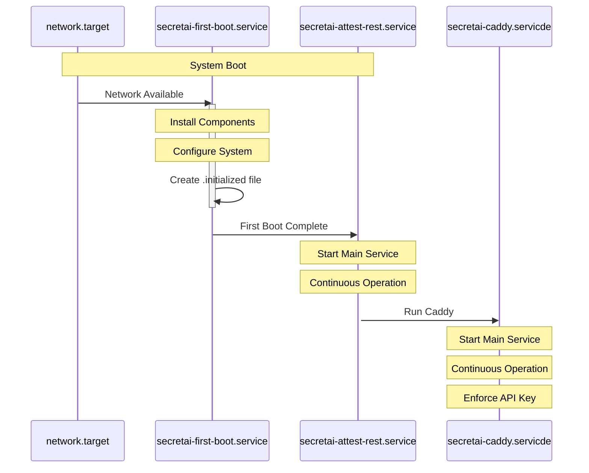

```mermaid

sequenceDiagram
    participant NT as network.target
    participant FB as secretai-first-boot.service
    participant AS as secretai-attest-rest.service
    participant CD as secretai-caddy.servicde
    
    Note over NT,AS: System Boot
    
    NT->>FB: Network Available
    activate FB
    Note over FB: Install Components
    Note over FB: Configure System
    FB->>FB: Create .initialized file
    deactivate FB
    
    FB->>AS: First Boot Complete
    activate AS
    Note over AS: Start Main Service
    Note over AS: Continuous Operation

    AS->>CD: Run Caddy
    activate CD
    Note over CD: Start Main Service
    Note over CD: Continuous Operation
    Note over CD: Enforce API Key
```