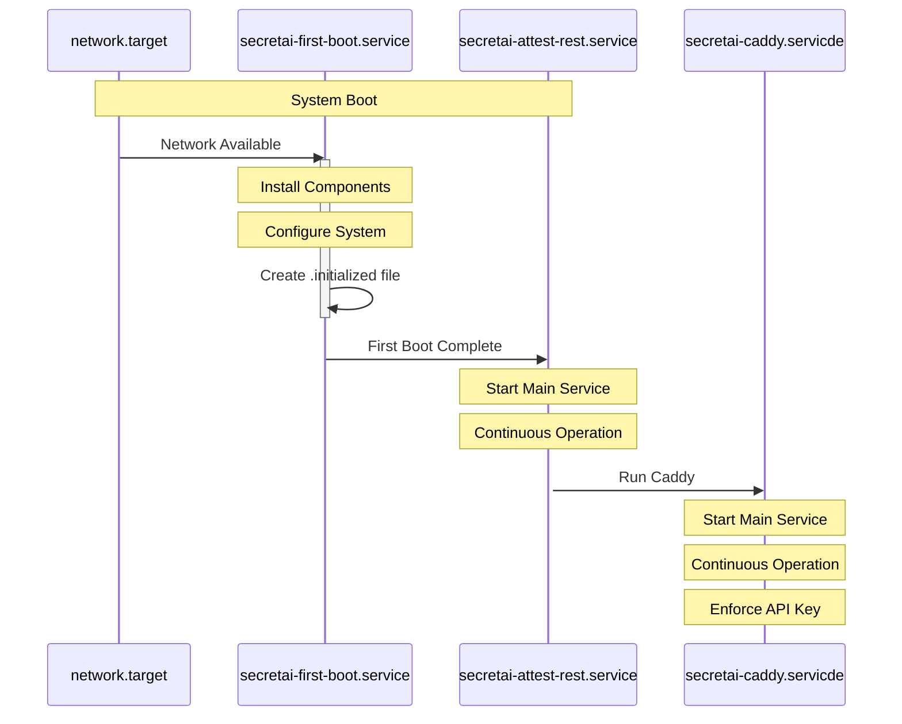

# SecretAI TD Confidential VM

This project implements a Trusted Domain (TD) Confidential Virtual Machine setup for SecretAI, providing secure attestation and proxy services. The system consists of three main components that work together to ensure secure operation in a confidential computing environment.

## System Components

### 1. First Boot Service (`secretai-first-boot.service`)

This service handles the initial configuration of the TD Confidential VM on its first boot. For detailed information about the initialization process and configuration, see [First Boot Service Documentation](secretai_first_boot_service.md).

**Key Features:**
- Runs once during the first system boot
- Configures initial system settings before other services start
- Creates necessary initialization markers
- Installs and configures all required system components
- Sets up SSL certificates and security configurations

**Service Configuration Details:**
- `After=network.target`: Ensures network connectivity is available before starting
- `Before=secretai-attest-rest.service`: Must complete before the attestation service starts
- `ConditionPathExists=!/etc/secretai-attest/.initialized`: Only runs if the initialization marker doesn't exist
- `Type=oneshot`: Service runs once and completes
- `RemainAfterExit=yes`: Systemd considers the service active even after the process exits
- `ExecStartPost=/bin/touch /etc/secretai-attest/.initialized`: Creates initialization marker after successful completion

### 2. Attestation REST Service (`secretai-attest-rest.service`)

This service provides attestation capabilities for the TD Confidential VM through a REST API. For detailed information about the build and installation process, see [Attestation Service Build Documentation](secretai_build_install_attest.md).

**Key Features:**
- Runs as a dedicated service user (`secretai-attest`)
- Provides attestation endpoints for the VM
- Automatically restarts on failure

**Service Configuration Details:**
- `After=network.target secretai-first-boot.service`: Starts after network and first boot configuration
- `Requires=secretai-first-boot.service`: Explicitly requires first boot service completion
- `ConditionPathExists=/etc/secretai-attest/.initialized`: Only starts if system is initialized
- `Type=simple`: Runs as a simple long-running process
- `WorkingDirectory=/opt/secretai-attest-rest`: Sets the working directory for the service
- `Environment=PATH=...`: Defines the Python virtual environment and system PATH
- `RestartSec=10`: Waits 10 seconds before attempting restart on failure

### 3. Caddy Reverse Proxy Service (`secretai-caddy.service`)

This service provides reverse proxy capabilities, managing external access to the attestation service. For detailed information about the build, installation, and configuration process, see [Caddy Reverse Proxy Documentation](secretai_build_install_caddy.md).

**Key Features:**
- Runs as a dedicated service user (`caddy`)
- Handles TLS termination
- Provides secure access to internal services

**Service Configuration Details:**
- `After=network.target secretai-attest-rest.service`: Starts after network and attestation service
- `WorkingDirectory=/etc/caddy`: Sets the working directory for Caddy configuration
- `ExecStart=/usr/local/bin/caddy run --config /etc/caddy/Caddyfile`: Runs Caddy with specific configuration
- `Restart=always`: Ensures the service always restarts on failure

## Installation and Setup

The services are installed and configured using the following steps:

1. Service files are copied to systemd:
   ```bash
   sudo cp secretai-first-boot.service /etc/systemd/system/
   sudo cp secretai-attest-rest.service /etc/systemd/system/
   sudo cp secretai-caddy.service /etc/systemd/system/
   ```

2. Installation scripts are placed in system path:
   ```bash
   sudo cp secretai_first_boot_service.sh /usr/local/bin/
   sudo cp secretai_attest_rest_service.sh /usr/local/bin/
   sudo chmod +x /usr/local/bin/secretai_first_boot_service.sh
   sudo chmod +x /usr/local/bin/secretai_attest_rest_service.sh
   ```

3. Services are enabled and started:
   ```bash
   sudo systemctl daemon-reload
   sudo systemctl enable secretai-first-boot
   sudo systemctl enable secretai-attest-rest
   sudo systemctl enable secretai-caddy
   ```

## Service Dependencies

The services have a specific startup order:

1. `secretai-first-boot.service` runs first and initializes the system
2. `secretai-attest-rest.service` starts after initialization is complete
3. `secretai-caddy.service` starts last, providing external access to the services

## Services Sequence Diagram



## System Requirements

- Ubuntu-based system with UFW firewall
- Root/sudo access for installation
- Sufficient disk space in `/opt` and `/etc` directories
- Network connectivity for package installation and service operation